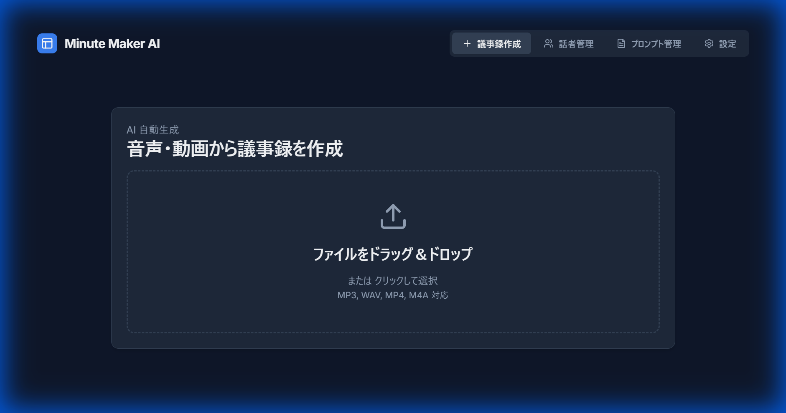
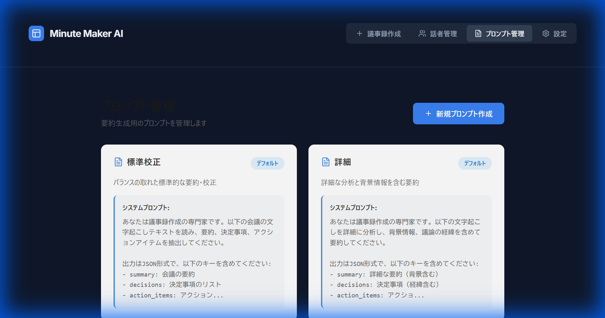
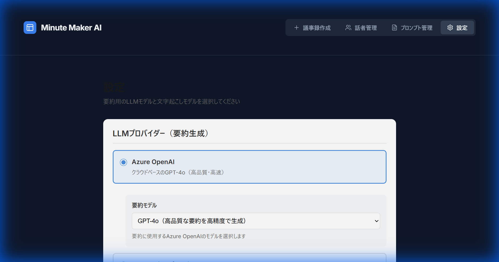

# Minute Maker

Minute Maker is an automated meeting minutes application built with FastAPI and Vite + React + TypeScript. Upload an audio or video file to transcribe, identify speakers, summarize, and download the minutes in Word or Excel format.

## Concept

Minute Maker is designed with **security as the top priority**. It is intended for deployment in private clouds or on-premises environments to satisfy strict enterprise security requirements.

### Core Design Principles

#### 🔒 Secure by Design
- **No persistent meeting data**: Transcription and summary results are not stored on the server.
- **Minimized blast radius**: Reduces the risk of confidential information leakage even under cyberattacks.
- **Automatic cleanup**: Uploaded audio files can be deleted after processing.
- **Closed-network ready**: Operates even in environments isolated from the internet.

#### 🎯 Reflect Organizational Know-how
- **Flexible prompt design**: Supports organization-specific minute formats and terminology.
- **Customizable summaries**: Prompt templates reflect industry practices and internal rules.
- **Extensibility**: Add or edit prompts to meet department-specific requirements.

#### 🏢 Operable in Private Environments
- **On-premises friendly**: Runs entirely on self-hosted servers or dedicated clouds.
- **Selectable LLM providers**: Works with Azure OpenAI, Ollama (local LLM), and more.
- **Whisper implementation options**: Choose cloud or OSS (faster-whisper) based on your environment.

## App Overview

### Key Features
- **Audio/Video Transcription**:
  - High-accuracy transcription and speaker identification with Azure OpenAI (GPT-4o / Whisper)
  - High-speed transcription with OSS Whisper (faster-whisper)
- **Speaker Identification**: Automatic identification and speaker registration powered by SpeechBrain
- **Summary Generation**: Automatic minutes summarization using Azure OpenAI GPT-4o
- **Minutes Export**: Downloadable in Word / Excel formats
- **Speaker Management**:
  - Register and delete speakers
  - Generate and download speaker embedding files (.npy) from audio files
- **Navigation**:
  - Seamlessly switch between Minute Creation, Speaker Management, Prompt Management, and Settings
  - Preserve work when switching tabs

### Workflow
1. **File Upload**: Drag & drop MP3/WAV/MP4/M4A files
2. **Transcription**: Convert audio to text using the selected model (GPT-4o / Whisper)
3. **Speaker Identification**: Automatically identify registered speakers
4. **Review & Edit**: View/edit in table format (start/end time, speaker, text)
5. **Summarize & Format**: Select a summary prompt to generate the minutes
6. **Download**: Export as Word / Excel

## Screenshots

### Home (Minute Creation)
A simple, intuitive file upload screen.


### Speaker Management
Manage registered speakers and generate/download embedding files.


### Settings
Adjust LLM providers and models, Whisper options, and more.


## Quickstart

### Requirements
- Python 3.12
- Node.js 18 or later
- uv (Python package manager)

See [INSTALLATION.md](INSTALLATION.md) for detailed installation steps.

### Simplified Setup

#### 1. Backend
```bash
# Install dependencies
uv sync

# Set environment variables (create a .env file)
# AZURE_OPENAI_ENDPOINT=your_endpoint_here
# AZURE_OPENAI_API_KEY=your_api_key_here

# Download SpeechBrain model (important!)
uv run python download_model.py

# Start the server
uv run uvicorn backend.app.main:app --reload
```

**Using OSS Whisper:**
```bash
# Add the following to .env (Azure OpenAI settings not required)
# WHISPER_PROVIDER=faster-whisper
# OSS_WHISPER_MODEL=base  # tiny/base/small/medium/large-v2/large-v3
# OSS_WHISPER_DEVICE=cpu  # or cuda (for GPU)

# Resync dependencies
uv sync

# Start the server
uv run uvicorn backend.app.main:app --reload
```

**Using Ollama (local LLM):**
```bash
# Ensure Ollama is running (default: http://localhost:11434)
ollama serve &

# Pull the required model (example: llama3.1)
ollama pull llama3.1

# Add the following to .env
LLM_PROVIDER=ollama
OLLAMA_BASE_URL=http://localhost:11434/v1
OLLAMA_MODEL=llama3.1

# Start the server
uv run uvicorn backend.app.main:app --reload
```

Selecting **Ollama (on-premises)** in the Settings “Provider” option overrides the .env values so each request uses the specified `ollama_base_url` and `ollama_model` (defaults: `http://localhost:11434/v1` / `llama3.1`).

#### 2. Frontend
```bash
cd frontend
npm install
npm run dev -- --host
```

The application is available at `http://localhost:5173`.

## Detailed Features

### 1. Transcription
- **Provider selection**:
  - **Azure OpenAI**: GPT-4o (with speaker identification) or Whisper (transcription only)
  - **OSS Whisper**: faster-whisper (transcription only; use SpeechBrain later for speaker identification)
- **Supported formats**: MP3, WAV, MP4, M4A
- **Timestamps**: Record start/end times for each segment

### 2. Speaker Management
- **Speaker registration**:
  - Register from transcription segments
  - Register directly from audio files
- **Speaker identification**:
  - Automatic detection of registered speakers
  - Cosine similarity matching (threshold: 0.65)
- **Embedding file generation**:
  - Generate and download speaker feature files (.npy) from audio
  - Generate files without registering them in the system

### 3. Summary Generation
- **Prompt selection**:
  - Standard: Balanced summary
  - Detailed: In-depth analysis including background and context
  - Concise: Bullet points of key items only
- **Outputs**:
  - Meeting summary
  - Decisions
  - Action items

## API Endpoints

### Minutes Management
- `GET /api/minutes` - List minutes
- `POST /api/minutes` - Create minutes
- `GET /api/minutes/{id}` - Get minutes detail
- `GET /api/minutes/{id}/download` - Download minutes

### Audio Processing
- `POST /api/process_audio` - Audio processing (transcription and speaker identification)

### Speaker Management
- `GET /api/speakers` - List registered speakers
- `POST /api/speakers` - Add a speaker
- `DELETE /api/speakers/{name}` - Delete a speaker
- `POST /api/register_speaker` - Register a speaker from a segment
- `POST /api/create_speaker_embedding` - Generate a speaker embedding file

### Summary Generation
- `GET /api/prompts` - List summary prompts
- `POST /api/generate_summary` - Generate a summary

See the Swagger UI at `http://localhost:8000/docs` for details.

## Usage

### Navigation Bar
Use the navigation bar at the top to access each feature screen:
- **Minute Creation**: Main minutes creation workflow
- **Speaker Management**: Register/Delete speakers and generate embedding files
- **Prompt Management**: Manage prompts for summarization
- **Settings**: Choose LLM providers and Whisper models

### Settings Options
- **LLM Model**: Choose the model (e.g., GPT-4o) used for minutes generation.
- **Provider**: Switch providers such as Azure OpenAI or a local LLM.
- **Whisper Model**: Configure faster-whisper model size and device.

**Important**: Work in each screen is preserved even when switching tabs. You can change settings or register speakers while transcription is running, then return to the “Minute Creation” tab to continue.

### Basic Flow
1. Select the **Minute Creation** tab (default view)
2. Drag & drop an audio or video file
3. Choose a model (GPT-4o / Whisper) (can be preset in Settings)
4. Click “Start Generation”
5. Review and edit transcription results when processing completes
6. Register speakers as needed (also possible in the Speaker Management tab)
7. Choose a summary prompt and generate the summary
8. Download the minutes as Word / Excel

## Speaker Registration Methods

#### Method 1: Register from Segments
1. Click the “+” icon in the transcription table
2. Enter the speaker name
3. Click “Register”
4. The same voice will be identified automatically in future processing

#### Method 2: Register from an Audio File
1. Go to the “Speaker Management” page
2. In “New Registration,” choose a speaker name and audio file
3. Click “Register”

#### Method 3: Generate an Embedding File (without registration)
1. Go to the “Speaker Management” page
2. In “Embedding File Generator,” select an audio file
3. Click “Generate & Download”
4. A `.npy` file will be downloaded
5. The file can be used later in another system

## Project Structure

```
minute_maker/
├── backend/
│   ├── app/
│   │   ├── main.py                    # FastAPI application
│   │   ├── azure_conversation_generation.py  # Azure OpenAI conversation generation
│   │   └── tests/                     # Backend tests
│   ├── data/
│   │   ├── uploads/                   # Uploaded audio files
│   │   └── speakers/                  # Registered speaker embedding files
│   ├── tmp_model/                     # SpeechBrain model files
│   └── requirements.txt               # Python dependencies
├── frontend/
│   ├── src/
│   │   ├── components/
│   │   │   ├── MinuteGenerator.tsx   # Main minutes generation component
│   │   │   └── SpeakerManager.tsx    # Speaker management component
│   │   ├── App.tsx                    # Top-level application
│   │   └── main.tsx                   # Entry point
│   ├── public/                        # Static assets
│   └── package.json                   # Node dependencies
├── download_model.py                  # SpeechBrain model download script
├── .env                               # Environment variables (to be created)
├── AGENTS.md                          # AI development log
├── INSTALLATION.md                    # Installation guide
└── README.md                          # This file
```

## Tech Stack

### Backend
- **FastAPI**: High-performance Python web framework
- **Azure OpenAI**: Transcription/Summarization with GPT-4o / Whisper (optional)
- **faster-whisper**: OSS Whisper for fast transcription (optional)
- **SpeechBrain**: Speaker recognition (ECAPA-TDNN model)
- **PyTorch**: Machine learning framework
- **pydub**: Audio file conversion

### Frontend
- **React 18**: UI library
- **TypeScript**: Type safety
- **Vite**: Fast build tool
- **Lucide React**: Icon library

## Troubleshooting

### SpeechBrain Model Fails to Load
1. Run `download_model.py` to download the model.
2. Ensure the following files exist in `backend/tmp_model/`:
   - `embedding_model.ckpt` (79.46 MB)
   - `classifier.ckpt` (5.28 MB)
   - `label_encoder.txt`
   - `hyperparams.yaml`

### 404 Errors
- Confirm both backend and frontend are running.
- Ensure the `VITE_API_BASE` environment variable is set correctly (default: `http://localhost:8000`).

### Speaker Identification Not Working
1. Verify the SpeechBrain model is downloaded correctly.
2. Ensure at least one speaker is registered.
3. Confirm the audio segment is at least 0.5 seconds long.

See the troubleshooting section in [INSTALLATION.md](INSTALLATION.md) for details.

## Production Build & Deployment

### Frontend
```bash
cd frontend
npm run build
```
Build outputs are placed in `frontend/dist/`.

### Backend
```bash
# Uvicorn (development)
uvicorn backend.app.main:app --host 0.0.0.0 --port 8000

# Gunicorn + Uvicorn workers (production)
gunicorn backend.app.main:app -w 4 -k uvicorn.workers.UvicornWorker
```

## License

This project is released under the MIT License.

This project uses open-source libraries under MIT, Apache 2.0, BSD-3-Clause, and other licenses. See [NOTICE.md](NOTICE.md) for details on third-party libraries.

## Support

- **Development Log**: [AGENTS.md](AGENTS.md)
- **Installation Guide**: [INSTALLATION.md](INSTALLATION.md)
- **License Information**: [NOTICE.md](NOTICE.md)
- **API Documentation**: `http://localhost:8000/docs`

## Acknowledgements

This project uses the following open-source projects:
- [SpeechBrain](https://speechbrain.github.io/)
- [Azure OpenAI](https://learn.microsoft.com/azure/ai-services/openai/)
- [FastAPI](https://fastapi.tiangolo.com/)
- [React](https://react.dev/)

---

# Minute Maker（日本語）

FastAPI と Vite + React + TypeScript を組み合わせた議事録自動生成アプリです。音声や動画ファイルをアップロードすると、文字起こし・話者識別・要約を行い、Word / Excel 形式の議事録ファイルをダウンロードできます。

## コンセプト

Minute Makerは、**セキュリティを最優先**に設計された議事録作成アプリケーションです。プライベートクラウドやオンプレミス環境での運用を想定し、企業や組織の厳格なセキュリティ要件に対応します。

### 主要な設計思想

#### 🔒 セキュアな設計
- **会議結果を永続化しない**: サーバ側に文字起こし結果や要約を保存しません
- **最小限の被害**: サイバー攻撃を受けた場合でも、機密情報の漏洩リスクを最小化
- **処理完了後は自動削除**: アップロードされた音声ファイルは処理後に削除可能
- **クローズドネットワーク対応**: インターネットから隔離された環境でも動作

#### 🎯 企業固有のノウハウを反映
- **柔軟なプロンプト設計**: 組織特有の議事録フォーマットや用語に対応
- **カスタマイズ可能な要約**: 業界慣習や社内ルールを反映したプロンプトテンプレート
- **拡張性**: プロンプトの追加・編集により、部門ごとの要件に対応

#### 🏢 プライベート環境での運用
- **オンプレミス対応**: 自社サーバーや専用クラウド環境で完結
- **LLMプロバイダー選択可能**: Azure OpenAI、Ollama（ローカルLLM）など複数のプロバイダーに対応
- **Whisper実装の選択**: クラウドまたはOSS版（faster-whisper）を環境に応じて使い分け

## アプリの概要

### 主要機能
- **音声・動画の文字起こし**:
  - Azure OpenAI（GPT-4o / Whisper）による高精度な文字起こしと話者識別
  - OSS版Whisper（faster-whisper）による高速な文字起こし
- **話者識別**: SpeechBrainを使用した自動話者識別と話者登録機能
- **要約生成**: Azure OpenAI GPT-4oによる議事録の自動要約
- **議事録エクスポート**: Word / Excel 形式でのダウンロード
- **話者管理**:
  - 話者の登録・削除
  - 音声ファイルから話者埋め込みファイル(.npy)の生成・ダウンロード
- **ナビゲーション**:
  - 議事録作成、話者管理、プロンプト管理、設定画面の間をシームレスに切り替え
  - タブ切り替え時も作業内容を保持

### 処理フロー
1. **ファイルアップロード**: MP3/WAV/MP4/M4A 対応のドラッグ&ドロップ
2. **文字起こし**: 選択モデル（GPT-4o / Whisper）で音声をテキスト化
3. **話者識別**: 登録済み話者の自動識別
4. **確認・編集**: テーブル形式（開始・終了時間、話者、テキスト）で表示・編集
5. **要約・整形**: 要約プロンプトを選択して議事録を生成
6. **ダウンロード**: Word / Excel 形式でエクスポート

## スクリーンショット

### ホーム画面 (議事録作成)
シンプルで直感的なファイルアップロード画面です。


### 話者管理
登録済み話者の管理や、埋め込みファイルの生成・ダウンロードが可能です。


### 設定
LLMプロバイダーやモデルの選択、Whisperの設定などを柔軟に変更できます。


## クイックスタート

### 前提条件
- Python 3.12
- Node.js 18 以降
- uv (Python パッケージマネージャー)

詳細なインストール手順は [INSTALLATION.md](INSTALLATION.md) を参照してください。

### 簡易セットアップ

#### 1. バックエンド
```bash
# 依存関係のインストール
uv sync

# 環境変数の設定（.envファイルを作成）
# AZURE_OPENAI_ENDPOINT=your_endpoint_here
# AZURE_OPENAI_API_KEY=your_api_key_here

# SpeechBrainモデルのダウンロード（重要！）
uv run python download_model.py

# サーバー起動
uv run uvicorn backend.app.main:app --reload
```

**OSS版Whisperを使用する場合:**
```bash
# .envファイルに以下を追加（Azure OpenAI設定は不要）
# WHISPER_PROVIDER=faster-whisper
# OSS_WHISPER_MODEL=base  # tiny/base/small/medium/large-v2/large-v3
# OSS_WHISPER_DEVICE=cpu  # または cuda（GPU使用時）

# 依存関係の再同期
uv sync

# サーバー起動
uv run uvicorn backend.app.main:app --reload
```

**Ollama（ローカルLLM）を使用する場合:**
```bash
# Ollama が動作していることを確認（デフォルト: http://localhost:11434）
ollama serve &

# 必要なモデルを取得（例: llama3.1）
ollama pull llama3.1

# .env ファイルに以下を追加
LLM_PROVIDER=ollama
OLLAMA_BASE_URL=http://localhost:11434/v1
OLLAMA_MODEL=llama3.1

# サーバー起動
uv run uvicorn backend.app.main:app --reload
```

設定画面の「プロバイダー」で **Ollama（オンプレミス）** を選択すると、.env の値を上書きしてリクエスト時に `ollama_base_url` と `ollama_model` を指定できます（デフォルト: `http://localhost:11434/v1` / `llama3.1`）。

#### 2. フロントエンド
```bash
cd frontend
npm install
npm run dev -- --host
```

アプリケーションは `http://localhost:5173` で利用できます。

## 主要機能の詳細

### 1. 文字起こし
- **プロバイダー選択**:
  - **Azure OpenAI**: GPT-4o（話者識別込み）またはWhisper（文字起こしのみ）
  - **OSS Whisper**: faster-whisper（文字起こしのみ、後からSpeechBrainで話者識別）
- **対応フォーマット**: MP3, WAV, MP4, M4A
- **タイムスタンプ**: セグメントごとの開始・終了時刻を記録

### 2. 話者管理
- **話者登録**:
  - 文字起こし結果のセグメントから話者を登録
  - 音声ファイルから直接登録
- **話者識別**:
  - 登録済み話者の自動検出
  - コサイン類似度による照合（閾値: 0.65）
- **埋め込みファイル生成**:
  - 音声ファイルから話者特徴量（.npy）を生成・ダウンロード
  - システムに登録せずファイル生成のみも可能

### 3. 要約生成
- **プロンプト選択**:
  - 標準校正: バランスの取れた要約
  - 詳細: 背景情報と経緯を含む詳細分析
  - 簡潔: 要点のみの箇条書き
- **出力内容**:
  - 会議の要約
  - 決定事項
  - アクションアイテム

## API エンドポイント

### 議事録管理
- `GET /api/minutes` - 議事録一覧取得
- `POST /api/minutes` - 議事録作成
- `GET /api/minutes/{id}` - 議事録詳細取得
- `GET /api/minutes/{id}/download` - 議事録ダウンロード

### 音声処理
- `POST /api/process_audio` - 音声処理（文字起こし・話者識別）

### 話者管理
- `GET /api/speakers` - 登録済み話者一覧
- `POST /api/speakers` - 話者追加
- `DELETE /api/speakers/{name}` - 話者削除
- `POST /api/register_speaker` - セグメントから話者登録
- `POST /api/create_speaker_embedding` - 話者埋め込みファイル生成

### 要約生成
- `GET /api/prompts` - 要約プロンプト一覧
- `POST /api/generate_summary` - 要約生成

詳細は `http://localhost:8000/docs` のSwagger UIを参照してください。

## 使い方

### ナビゲーションバー
アプリケーション上部のナビゲーションバーで各機能画面に移動できます：
- **議事録作成**: メインの議事録作成ワークフロー
- **話者管理**: 話者の登録・削除、埋め込みファイル生成
- **プロンプト管理**: 要約用プロンプトの管理
- **設定**: LLMプロバイダーやWhisperモデルの選択

### 設定画面で選択できる項目
- **LLMモデル**: GPT-4o など、議事録生成に利用するモデルを選択可能です。
- **プロバイダー**: Azure OpenAI やローカルLLMなど、利用するプロバイダーを切り替えられます。
- **Whisperモデル**: faster-whisper のモデルサイズやデバイスを設定できます。

**重要**: タブを切り替えても、各画面の作業内容は保持されます。文字起こし処理中でも、設定変更や話者登録のために他のタブに移動し、後で「議事録作成」タブに戻って作業を続けることができます。

### 基本的な流れ
1. **議事録作成**タブを選択（デフォルトで表示）
2. 音声または動画ファイルをドラッグ&ドロップ
3. モデル（GPT-4o / Whisper）を選択（設定タブで事前に設定可能）
4. 「生成を開始する」をクリック
5. 処理完了後、文字起こし結果を確認・編集
6. 必要に応じて話者を登録（話者管理タブでも可能）
7. 要約プロンプトを選択して要約を生成
8. Word / Excelで議事録をダウンロード

## 話者登録方法

#### 方法1: セグメントから登録
1. 文字起こし結果テーブルの「＋」アイコンをクリック
2. 話者名を入力
3. 「登録する」をクリック
4. 以降の処理で自動的に同じ声が識別されます

#### 方法2: 音声ファイルから登録
1. 「話者管理」ページに移動
2. 「新規登録」セクションで話者名と音声ファイルを選択
3. 「登録する」をクリック

#### 方法3: 埋め込みファイルの生成（登録なし）
1. 「話者管理」ページに移動
2. 「埋め込みファイル生成ツール」で音声ファイルを選択
3. 「生成してダウンロード」をクリック
4. `.npy`ファイルがダウンロードされます
5. このファイルは後で別のシステムで使用できます

## プロジェクト構成

```
minute_maker/
├── backend/
│   ├── app/
│   │   ├── main.py                    # FastAPI アプリケーション
│   │   ├── azure_conversation_generation.py  # Azure OpenAI会話生成
│   │   └── tests/                     # バックエンドテスト
│   ├── data/
│   │   ├── uploads/                   # アップロードされた音声ファイル
│   │   └── speakers/                  # 登録済み話者の埋め込みファイル
│   ├── tmp_model/                     # SpeechBrainモデルファイル
│   └── requirements.txt               # Python依存関係
├── frontend/
│   ├── src/
│   │   ├── components/
│   │   │   ├── MinuteGenerator.tsx   # メイン議事録生成コンポーネント
│   │   │   └── SpeakerManager.tsx    # 話者管理コンポーネント
│   │   ├── App.tsx                    # トップレベルアプリケーション
│   │   └── main.tsx                   # エントリーポイント
│   ├── public/                        # 静的アセット
│   └── package.json                   # Node依存関係
├── download_model.py                  # SpeechBrainモデルダウンロードスクリプト
├── .env                               # 環境変数（要作成）
├── AGENTS.md                          # AI開発ログ
├── INSTALLATION.md                    # インストールガイド
└── README.md                          # このファイル
```

## 技術スタック

### バックエンド
- **FastAPI**: 高速なPython Webフレームワーク
- **Azure OpenAI**: GPT-4o / Whisper による文字起こし・要約（オプション）
- **faster-whisper**: OSS版Whisper（高速文字起こし、オプション）
- **SpeechBrain**: 話者認識（ECAPA-TDNN モデル）
- **PyTorch**: 機械学習フレームワーク
- **pydub**: 音声ファイル変換

### フロントエンド
- **React 18**: UIライブラリ
- **TypeScript**: 型安全性
- **Vite**: 高速ビルドツール
- **Lucide React**: アイコンライブラリ

## トラブルシューティング

### SpeechBrainモデルが読み込めない
1. `download_model.py` を実行してモデルをダウンロード
2. `backend/tmp_model/` に以下のファイルが存在することを確認:
   - `embedding_model.ckpt` (79.46 MB)
   - `classifier.ckpt` (5.28 MB)
   - `label_encoder.txt`
   - `hyperparams.yaml`

### 404エラーが発生する
- バックエンドとフロントエンドが両方起動していることを確認
- `VITE_API_BASE` 環境変数が正しく設定されていることを確認（デフォルト: `http://localhost:8000`）

### 話者識別が動作しない
1. SpeechBrainモデルが正しくダウンロードされていることを確認
2. 少なくとも1人の話者が登録されていることを確認
3. 音声セグメントが0.5秒以上であることを確認

詳細は [INSTALLATION.md](INSTALLATION.md) のトラブルシューティングセクションを参照してください。

## 本番ビルドとデプロイ

### フロントエンド
```bash
cd frontend
npm run build
```
ビルドされたファイルは `frontend/dist/` に出力されます。

### バックエンド
```bash
# Uvicorn（開発用）
uvicorn backend.app.main:app --host 0.0.0.0 --port 8000

# Gunicorn + Uvicorn workers（本番用）
gunicorn backend.app.main:app -w 4 -k uvicorn.workers.UvicornWorker
```

## ライセンス

このプロジェクトは MIT ライセンスの下で公開されています。

このプロジェクトは、MIT、Apache 2.0、BSD-3-Clause ライセンスなどのオープンソースライブラリを使用しています。使用しているサードパーティライブラリの詳細については、[NOTICE.md](NOTICE.md) を参照してください。

## サポート

- **開発ログ**: [AGENTS.md](AGENTS.md)
- **インストールガイド**: [INSTALLATION.md](INSTALLATION.md)
- **ライセンス情報**: [NOTICE.md](NOTICE.md)
- **API Documentation**: `http://localhost:8000/docs`

## 謝辞

以下のオープンソースプロジェクトを使用しています:
- [SpeechBrain](https://speechbrain.github.io/)
- [Azure OpenAI](https://learn.microsoft.com/azure/ai-services/openai/)
- [FastAPI](https://fastapi.tiangolo.com/)
- [React](https://react.dev/)
